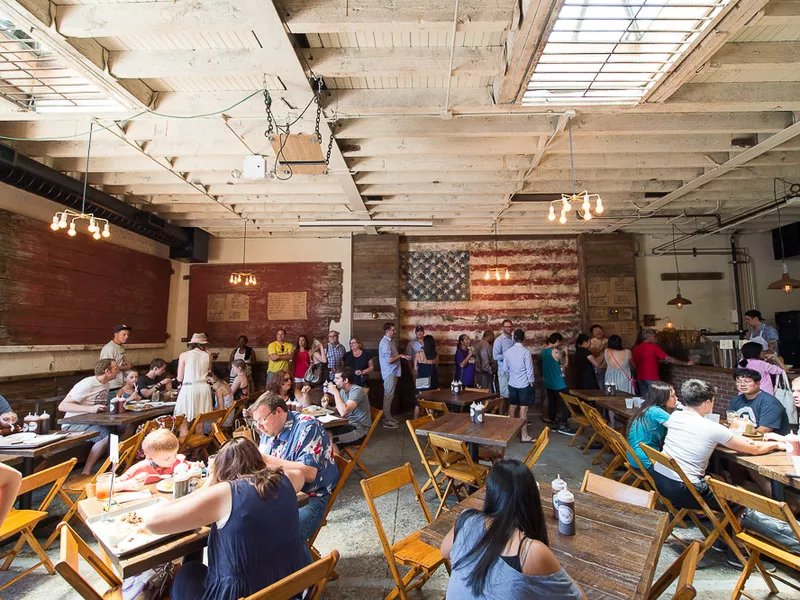

# Restaurant Review App

## Table Of Contents
* [Overview](#overview)
* [Specification](#specification)
* [Installation](#installation)
* [Dependencies](#dependencies)
* [Demo](#demo)
* [Author](#author)

## Overview

A static webpage is converted to a mobile-ready web application. The static design lacked accessibility and was converted to a webpage that is responsive on different sized displays and accessible for screen reader use. I also added a service worker to begin the process of creating a seamless offline experience for your users.

## Specification

Usable on desktop and mobile
Standard Accessibility Features
Works offline and cache pages that have been visited

## Installation

To run the application:

Clone the repository onto your local workstation: [git clone](https://github.com/Laludztee/Restaurant-Review-App.git)

1. Your computer should have python installed. To check, run python -V on your terminal
2. It your python version is 2.X, run the following on a terminal to start the server python -m SimpleHTTPServer 8000
3. If your python version is 3.X, run the folliwng on a terminal to start the server python3 -m http.server 8000
4. Visit Python's Website to download python if you don't have it installed
5. Launch the application from localhost:8000

Open a browser window and navigate to the index.html file in your application's directory.

## Dependencies

This repository uses [leafletjs](https://leafletjs.com/) with [Mapbox](https://www.mapbox.com/).
Most of the code in this project has been written to the ES6 JavaScript specification for compatibility with modern web browsers and future proofing JavaScript code. 

## Demo

[Click here](https://laludztee.github.io/Restaurant-Review-App/) to view the app live

## Author

Lalude Oluwatomisin

Initial starter file used: [Udacity](https://github.com/udacity/mws-restaurant-stage-1)
